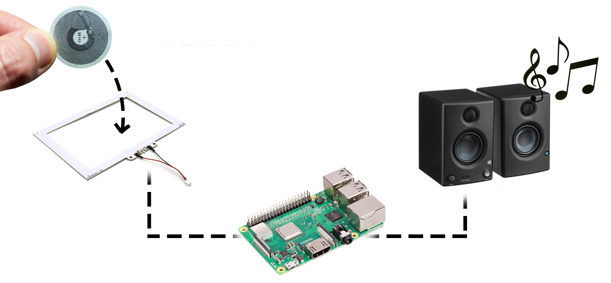

# ChuckBerry

**Chuck a tag onto a Raspberry, and hear the music!**

A small Python project that connects to
an NFC antenna, and acts as a Spotify Remote
to control music depending on which tag is on the sensor.


🎵 [Website][website] | 💻 [Blog post][blog]

### Getting started

1. First, follow the [installation instructions][install] or simply run
`./setup.sh`. **Designed to run on Raspbian**.
2. Copy the `.sample.env` file to `.env`, and edit it.
The `ENDPOINT` can either be a URL to a JSON endpoint, or a local JSON file.
This JSON is where you edit which tag plays which playlist.
Check the `sample.json` to see the required format.
3. Then run the script:

```bash
python3 ./main.py 
```

Running it as root allows you to shut down the Pi using a tag, if that is
something you'd want to do.



### More info

- Nexmosphere [serial protocol documentation][nexmo] (PDF).
- Installation instructions are in [INSTALL.md][install].

[nexmo]: https://nexmosphere.com/document/API_Manual_Q3_2021.pdf
[install]: ./INSTALL.md
[website]: https://pixplicity.com/chuckberry
[blog]: https://medium.com/@mathijsl/hi-im-the-chuckberry-da7e610baa7b
